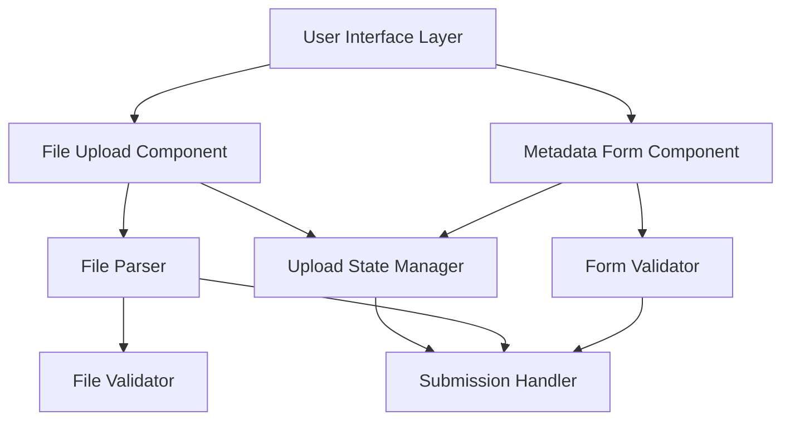
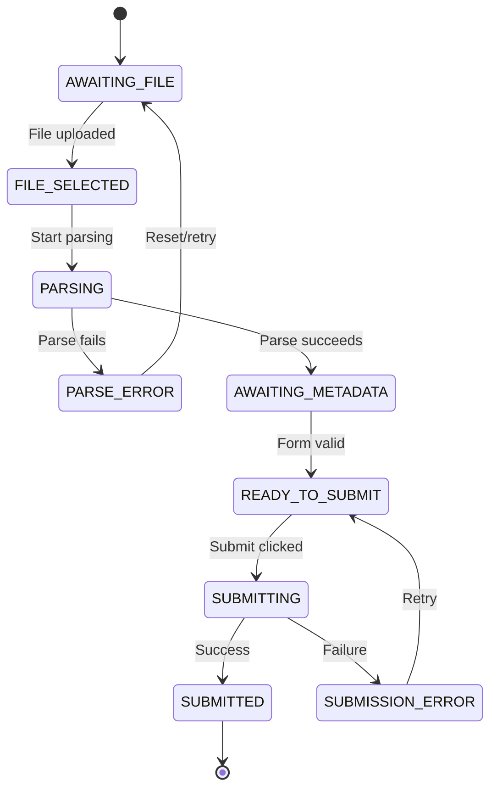

# Design Document: File Upload UI

## Overview

This design document describes a mobile-first file upload UI feature consisting of three main components: a drag-and-drop file upload interface, a file parser for processing uploaded files, and a metadata form for capturing place name and location information. The system is designed with a component-based architecture that supports progressive enhancement from mobile to desktop experiences.

The implementation follows a three-phase approach:
1. **Phase 1**: File Upload Component - Mobile-optimized drag-and-drop/tap-to-browse interface
2. **Phase 2**: File Parser - File processing and validation logic
3. **Phase 3**: Metadata Form - Place name and location input fields

The design prioritizes mobile usability with touch-friendly interactions, responsive layouts, and accessibility features while maintaining desktop compatibility through progressive enhancement.

## Architecture

### High-Level Architecture



### Component Hierarchy

```
FileUploadFeature
├── FileUploadComponent
│   ├── DropZone
│   ├── FileInput (hidden, triggered by tap)
│   ├── UploadStateDisplay
│   └── ErrorDisplay
├── FileParser
│   ├── FileReader
│   ├── FormatValidator
│   └── ContentExtractor
└── MetadataForm
    ├── PlaceNameInput
    ├── LocationInput
    ├── FormValidator
    └── SubmitButton
```

### Design Principles

1. **Mobile-First**: All components designed for mobile screens first, then enhanced for larger screens
2. **Progressive Enhancement**: Core functionality works on all devices, enhanced features for capable devices
3. **Component Isolation**: Each phase can be developed and tested independently
4. **State Management**: Centralized state management for upload session lifecycle
5. **Accessibility**: WCAG 2.1 AA compliance with touch-optimized interactions

## Components and Interfaces

### 1. File Upload Component

**Purpose**: Provides a mobile-optimized interface for users to upload files through touch or drag-and-drop.

**Interface**:
```typescript
interface FileUploadComponent {
  // Props
  acceptedFormats: string[];
  maxFileSize: number;
  onFileSelected: (file: File) => void;
  onError: (error: UploadError) => void;
  
  // State
  uploadState: UploadState;
  selectedFile: File | null;
  
  // Methods
  handleFileSelect(file: File): void;
  handleDragOver(event: DragEvent): void;
  handleDrop(event: DragEvent): void;
  handleTap(): void;
  reset(): void;
}

enum UploadState {
  IDLE = 'idle',
  DRAGGING = 'dragging',
  SELECTED = 'selected',
  ERROR = 'error'
}

interface UploadError {
  code: string;
  message: string;
}
```

**Mobile Optimizations**:
- Minimum touch target size: 44x44 CSS pixels
- Large, prominent tap-to-browse button for mobile
- Visual feedback optimized for touch interactions
- Responsive sizing that adapts to viewport width
- Native file picker integration on mobile devices

**Behavior**:
1. On mobile: Display prominent "Tap to Upload" button that triggers native file picker
2. On desktop: Display drop zone with drag-and-drop support
3. Show file name and size after selection
4. Validate file format and size before accepting
5. Provide clear error messages for invalid files

### 2. File Parser

**Purpose**: Processes uploaded files, validates format, and extracts content into structured data.

**Interface**:
```typescript
interface FileParser {
  // Configuration
  supportedFormats: FileFormat[];
  
  // Methods
  parse(file: File): Promise<ParseResult>;
  validate(file: File): ValidationResult;
  extractContent(file: File): Promise<FileContent>;
}

interface FileFormat {
  extension: string;
  mimeType: string;
  validator: (file: File) => boolean;
}

interface ParseResult {
  success: boolean;
  content?: FileContent;
  error?: ParseError;
}

interface ValidationResult {
  isValid: boolean;
  errors: string[];
}

interface FileContent {
  raw: string | ArrayBuffer;
  metadata: FileMetadata;
}

interface FileMetadata {
  name: string;
  size: number;
  type: string;
  lastModified: number;
}

interface ParseError {
  code: string;
  message: string;
  details?: any;
}
```

**Parsing Strategy**:
1. **Validation First**: Check file format and size before parsing
2. **Async Processing**: Use async/await for non-blocking file reading
3. **Error Handling**: Graceful degradation with descriptive error messages
4. **Format Detection**: Validate both file extension and MIME type
5. **Content Extraction**: Read file content based on detected format

**Supported Operations**:
- File format validation (extension and MIME type)
- File size validation
- Content reading (text, binary, or data URL)
- Metadata extraction
- Error reporting with recovery suggestions

### 3. Metadata Form Component

**Purpose**: Provides mobile-optimized input fields for place name and location metadata.

**Interface**:
```typescript
interface MetadataForm {
  // Props
  disabled: boolean;
  onSubmit: (data: FormData) => void;
  onValidationError: (errors: ValidationError[]) => void;
  
  // State
  formData: FormData;
  validationErrors: ValidationError[];
  isSubmitting: boolean;
  
  // Methods
  handleInputChange(field: string, value: string): void;
  validate(): boolean;
  submit(): void;
  reset(): void;
}

interface FormData {
  placeName: string;
  location: string;
}

interface ValidationError {
  field: string;
  message: string;
}
```

**Mobile Optimizations**:
- Input fields with minimum 44px height for touch
- Appropriate input types for optimal mobile keyboards
- Font size minimum 16px to prevent iOS zoom
- Single column layout on mobile
- Clear, visible labels above inputs
- Adequate spacing between fields (minimum 8px)
- Submit button positioned for easy thumb reach

**Validation Rules**:
1. Place name: Required, non-empty, trimmed
2. Location: Required, non-empty, trimmed
3. Real-time validation on blur
4. Submit-time validation before submission
5. Clear error messages displayed near relevant fields

### 4. Upload State Manager

**Purpose**: Manages the overall state of the upload session across all components.

**Interface**:
```typescript
interface UploadStateManager {
  // State
  currentState: SessionState;
  uploadedFile: File | null;
  parsedContent: FileContent | null;
  formData: FormData | null;
  
  // Methods
  setFile(file: File): void;
  setParseResult(result: ParseResult): void;
  setFormData(data: FormData): void;
  canSubmit(): boolean;
  reset(): void;
  getSubmissionPayload(): SubmissionPayload;
}

enum SessionState {
  AWAITING_FILE = 'awaiting_file',
  FILE_SELECTED = 'file_selected',
  PARSING = 'parsing',
  PARSE_ERROR = 'parse_error',
  AWAITING_METADATA = 'awaiting_metadata',
  READY_TO_SUBMIT = 'ready_to_submit',
  SUBMITTING = 'submitting',
  SUBMITTED = 'submitted',
  SUBMISSION_ERROR = 'submission_error'
}

interface SubmissionPayload {
  file: File;
  parsedContent: FileContent;
  metadata: FormData;
  timestamp: number;
}
```

**State Transitions**:


## Data Models

### File Model
```typescript
interface UploadFile {
  id: string;
  file: File;
  status: FileStatus;
  uploadedAt: Date;
  parsedContent?: FileContent;
  error?: UploadError;
}

enum FileStatus {
  PENDING = 'pending',
  PARSING = 'parsing',
  PARSED = 'parsed',
  ERROR = 'error'
}
```

### Form Data Model
```typescript
interface UploadMetadata {
  placeName: string;
  location: string;
  createdAt: Date;
  fileId: string;
}
```

### Submission Model
```typescript
interface UploadSubmission {
  id: string;
  file: UploadFile;
  metadata: UploadMetadata;
  submittedAt: Date;
  status: SubmissionStatus;
}

enum SubmissionStatus {
  PENDING = 'pending',
  SUCCESS = 'success',
  FAILED = 'failed'
}
```

### Validation Models
```typescript
interface FileValidation {
  isValid: boolean;
  errors: FileValidationError[];
}

interface FileValidationError {
  type: 'format' | 'size' | 'content';
  message: string;
}

interface FormValidation {
  isValid: boolean;
  fieldErrors: Map<string, string>;
}
```

## Responsive Design Specifications

### Breakpoints
```css
/* Mobile-first approach */
--mobile: 320px;      /* Small phones */
--mobile-large: 480px; /* Large phones */
--tablet: 768px;       /* Tablets */
--desktop: 1024px;     /* Desktop */
```

### Mobile Layout (< 768px)
- Single column layout
- Full-width components
- Stacked form fields
- Large touch targets (44x44px minimum)
- Bottom-positioned submit button
- 16px minimum font size

### Tablet Layout (768px - 1023px)
- Slightly wider components with margins
- Maintained single column for simplicity
- Larger spacing between elements

### Desktop Layout (≥ 1024px)
- Centered layout with max-width
- Drag-and-drop enabled
- Hover states for interactive elements
- Keyboard navigation support


## Correctness Properties

*A property is a characteristic or behavior that should hold true across all valid executions of a system—essentially, a formal statement about what the system should do. Properties serve as the bridge between human-readable specifications and machine-verifiable correctness guarantees.*

### File Upload Component Properties

**Property 1: Drag state activation**
*For any* drag event over the drop zone, the File_Upload_Component state should transition to "dragging" and provide visual feedback.
**Validates: Requirements 1.2, 2.2**

**Property 2: File acceptance on drop**
*For any* valid file dropped onto the drop zone, the File_Upload_Component should accept the file and update the upload state to include that file's information.
**Validates: Requirements 1.3**

**Property 3: File information display**
*For any* file that is successfully dropped, the File_Upload_Component should display that file's name and size in the UI.
**Validates: Requirements 2.3**

**Property 4: Error handling with retry**
*For any* upload error that occurs, the File_Upload_Component should display an error message and maintain the ability to accept a new file upload.
**Validates: Requirements 2.4, 4.5, 9.2**

**Property 5: Success indication**
*For any* file that is successfully uploaded and parsed, the File_Upload_Component should display a success indicator.
**Validates: Requirements 2.5**

### File Parser Properties

**Property 6: File parsing workflow**
*For any* uploaded file, the File_Parser should validate the format first, then read the content, and finally extract it into a structured format if validation passes.
**Validates: Requirements 3.1, 3.2, 3.4**

**Property 7: Invalid format rejection**
*For any* file with a format not in the acceptable formats list, the File_Parser should reject the file and return a descriptive error message without attempting to parse.
**Validates: Requirements 3.3, 4.2, 4.3**

**Property 8: Graceful error handling**
*For any* parsing error that occurs during file processing, the File_Parser should return error details without throwing unhandled exceptions.
**Validates: Requirements 3.5**

### Metadata Form Properties

**Property 9: Form field updates**
*For any* text input in either the place name or location field, the Metadata_Form should update the corresponding form state value to match the input.
**Validates: Requirements 5.3, 5.4**

**Property 10: Required field validation**
*For any* form state where the place name or location field contains only whitespace or is empty, the Metadata_Form validation should fail and mark those fields as invalid.
**Validates: Requirements 6.1, 6.2**

**Property 11: Submission prevention on invalid state**
*For any* form state with validation errors, the Metadata_Form should prevent submission and keep the submit button disabled or block the submit action.
**Validates: Requirements 6.3**

**Property 12: Validation error display**
*For any* submission attempt when required fields are empty, the Metadata_Form should display validation error messages for the invalid fields.
**Validates: Requirements 6.4**

**Property 13: Submission enablement on valid state**
*For any* form state where all required fields contain non-empty, non-whitespace values, the Metadata_Form should enable form submission.
**Validates: Requirements 6.5**

**Property 14: Submission trigger**
*For any* valid form state, clicking the submit button should trigger the submission process with the current form data.
**Validates: Requirements 7.2**

**Property 15: Submission payload completeness**
*For any* form submission, the submission payload should contain the uploaded file, parsed content, and form metadata as a complete unit.
**Validates: Requirements 7.3, 8.5**

**Property 16: Submission state management**
*For any* active submission process, the Metadata_Form should disable the submit button and display a loading indicator until the submission completes.
**Validates: Requirements 7.4**

**Property 17: Success feedback**
*For any* submission that completes successfully, the system should provide success feedback to the user.
**Validates: Requirements 7.5**

### Integration Properties

**Property 18: Automatic parsing trigger**
*For any* file uploaded through the File_Upload_Component, the File_Parser should automatically be invoked to process that file.
**Validates: Requirements 8.1**

**Property 19: Form enablement on parse success**
*For any* file that is successfully parsed, the Metadata_Form should transition from disabled to enabled state, allowing user input.
**Validates: Requirements 8.2**

**Property 20: Form disabled on parse failure**
*For any* file parsing that fails, the Metadata_Form should remain in disabled state until a new valid file is uploaded and successfully parsed.
**Validates: Requirements 8.3**

**Property 21: Upload session data integrity**
*For any* upload session, the relationship between the uploaded file, parsed content, and form metadata should be maintained throughout the session lifecycle (invariant).
**Validates: Requirements 8.4**

### Error Recovery Properties

**Property 22: Error message display**
*For any* error that occurs in any component (upload, parsing, or submission), the system should display a user-friendly error message describing the issue.
**Validates: Requirements 9.1**

**Property 23: Parse failure recovery**
*For any* file parsing failure, the system should allow the user to upload a different file without requiring a page refresh or component reset.
**Validates: Requirements 9.3**

**Property 24: Submission retry capability**
*For any* form submission failure, the Metadata_Form should allow the user to retry submission with the same or modified data.
**Validates: Requirements 9.4**

**Property 25: Form data preservation on error**
*For any* error that occurs after the user has entered form data, the form field values should remain unchanged, preventing data loss (invariant).
**Validates: Requirements 9.5**

### Accessibility Properties

**Property 26: Text alternatives for visual feedback**
*For any* visual feedback indicator (success, error, loading), a corresponding text alternative should be available for screen readers.
**Validates: Requirements 10.5**

## Error Handling

### Error Categories

1. **Upload Errors**
   - File too large
   - Invalid file type
   - Network failure during upload
   - Browser API not supported

2. **Parsing Errors**
   - Corrupted file content
   - Unsupported file format
   - File read permission denied
   - Parsing timeout

3. **Validation Errors**
   - Empty required fields
   - Invalid field format
   - Field length constraints

4. **Submission Errors**
   - Network failure
   - Server rejection
   - Timeout
   - Invalid payload

### Error Handling Strategy

**Principle**: Fail gracefully with clear recovery paths

**Implementation**:
```typescript
interface ErrorHandler {
  handleError(error: Error, context: ErrorContext): ErrorResponse;
  canRecover(error: Error): boolean;
  getRecoveryAction(error: Error): RecoveryAction;
}

interface ErrorContext {
  component: string;
  operation: string;
  timestamp: Date;
}

interface ErrorResponse {
  userMessage: string;
  technicalDetails?: string;
  recoveryActions: RecoveryAction[];
}

interface RecoveryAction {
  label: string;
  action: () => void;
  isPrimary: boolean;
}
```

**Error Display**:
- Mobile-optimized error messages (readable font size, adequate spacing)
- Clear, non-technical language for users
- Specific recovery actions (e.g., "Try a different file" vs. "OK")
- Persistent display until user acknowledges or recovers
- Technical details available in console for debugging

**Recovery Mechanisms**:
1. **Upload Errors**: Reset upload component, allow new file selection
2. **Parse Errors**: Clear current file, enable new upload
3. **Validation Errors**: Highlight invalid fields, keep form data
4. **Submission Errors**: Enable retry with same data, option to edit

## Testing Strategy

### Dual Testing Approach

This feature requires both unit tests and property-based tests for comprehensive coverage:

- **Unit tests**: Verify specific examples, edge cases, and error conditions
- **Property tests**: Verify universal properties across all inputs

Both testing approaches are complementary and necessary. Unit tests catch concrete bugs in specific scenarios, while property tests verify general correctness across a wide range of inputs.

### Property-Based Testing

**Library Selection**: 
- **JavaScript/TypeScript**: Use `fast-check` library for property-based testing
- **React Components**: Use `@testing-library/react` with `fast-check` for component property tests

**Configuration**:
- Minimum 100 iterations per property test (due to randomization)
- Each property test must reference its design document property
- Tag format: `// Feature: file-upload-ui, Property {number}: {property_text}`

**Property Test Implementation**:
Each correctness property listed above must be implemented as a single property-based test. The test should:
1. Generate random valid inputs using fast-check arbitraries
2. Execute the operation under test
3. Assert the property holds for all generated inputs
4. Include the property tag comment for traceability

**Example Property Test Structure**:
```typescript
// Feature: file-upload-ui, Property 2: File acceptance on drop
test('file acceptance on drop', () => {
  fc.assert(
    fc.property(
      fc.file(), // arbitrary file generator
      (file) => {
        const component = new FileUploadComponent();
        component.handleDrop(createDropEvent(file));
        
        expect(component.uploadState).toBe(UploadState.SELECTED);
        expect(component.selectedFile).toEqual(file);
      }
    ),
    { numRuns: 100 }
  );
});
```

### Unit Testing

**Focus Areas**:
- Specific examples demonstrating correct behavior
- Edge cases (empty files, maximum size files, special characters)
- Error conditions (network failures, invalid formats)
- Integration points between components
- Mobile-specific interactions (touch events, viewport changes)

**Balance**:
- Avoid writing too many unit tests for scenarios covered by property tests
- Focus unit tests on concrete examples and integration scenarios
- Use unit tests for UI-specific behavior that's hard to property-test

### Test Coverage by Phase

**Phase 1: File Upload Component**
- Property tests: Properties 1-5
- Unit tests: 
  - Idle state rendering
  - Mobile tap-to-browse interaction
  - Touch target size validation
  - Drag outside drop zone (ignored)
  - File size limit edge cases

**Phase 2: File Parser**
- Property tests: Properties 6-8
- Unit tests:
  - Specific file format examples (CSV, JSON, TXT)
  - Empty file handling
  - Maximum file size handling
  - Corrupted file content
  - Async parsing timeout

**Phase 3: Metadata Form**
- Property tests: Properties 9-17
- Unit tests:
  - Form rendering with proper labels
  - Mobile keyboard type triggering
  - Touch target size validation
  - Submit button positioning
  - Specific validation messages

**Integration Testing**
- Property tests: Properties 18-21
- Unit tests:
  - Complete upload-to-submission flow
  - Component communication
  - State transitions
  - Error propagation between components

**Error Recovery Testing**
- Property tests: Properties 22-25
- Unit tests:
  - Specific error scenarios
  - Recovery action execution
  - Data preservation examples

**Accessibility Testing**
- Property test: Property 26
- Unit tests:
  - ARIA label presence
  - Label-input associations
  - Screen reader announcements
  - Keyboard navigation flow
  - Focus management

### Mobile Testing Considerations

**Viewport Testing**:
- Test at multiple viewport widths (320px, 375px, 414px, 768px)
- Verify responsive breakpoints
- Check for horizontal scroll
- Validate touch target sizes

**Touch Interaction Testing**:
- Simulate touch events (touchstart, touchend)
- Test tap-to-browse on mobile
- Verify native file picker integration
- Test form field focus on mobile

**Performance Testing**:
- File upload performance on mobile networks
- Parsing performance for large files
- Form responsiveness on lower-end devices

### Test Execution

**Development**:
```bash
npm test                    # Run all tests
npm test:unit              # Run unit tests only
npm test:property          # Run property tests only
npm test:watch             # Watch mode for development
```

**CI/CD**:
```bash
npm test:ci                # Run all tests with coverage
npm test:mobile            # Run mobile-specific tests
npm test:a11y              # Run accessibility tests
```

**Coverage Goals**:
- Overall code coverage: > 80%
- Property test coverage: 100% of correctness properties
- Critical paths: 100% coverage
- Error handling: 100% coverage
